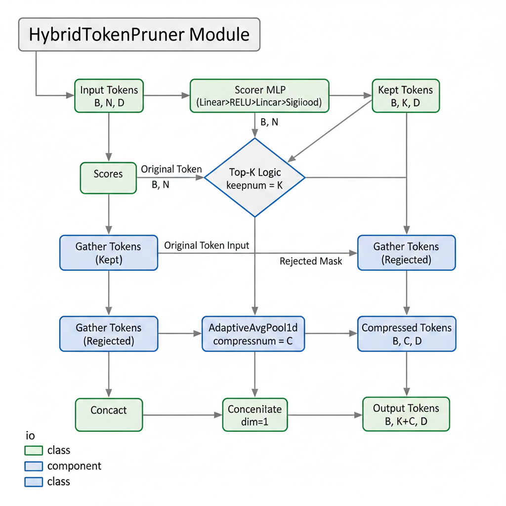

# ✂️ PrunerTinyLLaVA: Efficient Multimodal LLM on RTX 4060 laptop

**在消费级显卡上跑起来的高效多模态大模型 (Efficient MLLM)**

[](https://www.python.org/)
[](https://pytorch.org/)
[](./LICENSE)
# PrunerTinyLLaVA

Efficient Multimodal Large Language Model with Learnable Token Pruning  
运行于 RTX 4060 Laptop 的轻量多模态模型



---

## 🚀 Overview

PrunerTinyLLaVA 是一个面向消费级显卡的多模态 LLM 工程项目。  
目标是在 **有限显存（8GB）** 场景下，提供可训练、可推理的高效模型原型。

项目包含三部分核心组件：

1. **Vision Encoder:** SigLIP SO400M (patch14, 384px)  
2. **Language Model:** Qwen2.5-0.5B-Instruct  
3. **Hybrid Token Pruner:** 可学习 Token 剪枝模块，用于减少视觉 token 负载

Pruner 的任务是压缩 SigLIP 输出的 576 个视觉 token，并筛选出模型最依赖的部分，从而降低推理成本。

---

## ✨ Features

- **轻量化模型架构**  
  适合 3060 / 4060 Laptop 在 6GB VRAM 内训练。

- **Hybrid Token Pruner**  
  结合 Top-K 选择 + 平均池化压缩，视觉 token 从 **576 → 180**。

- **两阶段训练流程**  
  - Stage 1: Projector + Pruner 预训练  
  - Stage 2: 全量指令微调

- **显存占用低**  
  - 训练：约 5.5–6GB  
  - 推理：约 1.5–2GB

- **可复现工程结构**  
  代码模块化，易于修改和重新混搭。

---

## 📦 Project Structure

```text
PrunerTinyLLaVA/
├── data/                     # 数据集
│   ├── images/               # COCO / LLaVA 图像
│   └── annotations/          # caption / instruction 数据
│
├── local_models/             # 预训练模型缓存 (自动下载)
│
├── model.py                  # 模型结构 (LLM + Projector + Pruner)
├── pruner.py                 # Hybrid Token Pruner 模块
├── projector.py              # Vision → LLM Projector
├── dataset.py                # 数据处理
│
├── inference.py              # 推理脚本
├── train_stage1.py           # Stage 1 训练
├── train_stage2.py           # Stage 2 训练
│
├── requirements.txt          # Python 依赖
└── README.md
```

---

## 🛠️ 环境搭建 (Environment Setup)
```bash  
git clone https://github.com/your-username/PrunerTinyLLaVA.git
cd PrunerTinyLLaVA

conda create -n pruner-llava python=3.10 -y
conda activate pruner-llava

pip install -r requirements.txt
```

---

## 🚀 快速开始 (Quick Start)
### 1. 快速推理
```bash
python inference.py \
  --image_path "data/coco/images/val2017/000000000139.jpg" \
  --question "这张图片里有什么？" \
  --device cuda:0
```

### 2. 分阶段训练
```bash
python train_stage1.py \
  --batch_size 1 \
  --gradient_accumulation_steps 8 \
  --output_dir "output_stage1"

python train_stage2.py \
  --batch_size 1 \
  --gradient_accumulation_steps 8 \
  --stage1_ckpt "output_stage1/best_model.pth" \
  --output_dir "output_stage2"
```

---

## 🙏 致谢 (Acknowledgements)
- 感谢 LLaVA 项目提供多模态模型基础框架
- 感谢 Qwen 团队开源轻量化语言模型
- 感谢 SigLIP 提供高效视觉塔

